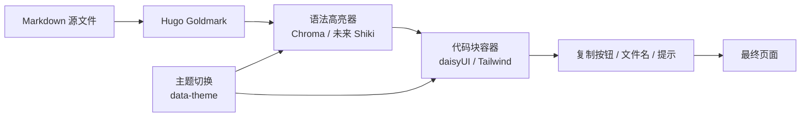

# Markdown 代码渲染方案

> 目标：让博客里的 Markdown 代码块更统一、更好看、可切主题，同时保留 Hugo 现有的静态渲染优势。

## 结论

`daisyUI` 适合做代码块的外壳和整体主题层，但**不替代**代码语法高亮引擎。

当前主题已经有一条可用链路：

- Hugo Goldmark 负责把 Markdown 转成 HTML
- `markup.highlight.noClasses = false` 让 Hugo 输出语法高亮 class
- `Chroma` 负责代码着色
- `single.html` 和 `code-copy.html` 负责复制按钮
- `typography.css` 负责文章内容和代码块的最终外观

所以最合理的路线不是“全盘推倒重来”，而是：

1. 继续保留 Hugo/Chroma 作为默认代码渲染引擎。
2. 用 `daisyUI` 统一代码块容器、按钮、提示、卡片、导航等 UI。
3. 如果后续对代码视觉要求更高，再评估 `Shiki`。

## 现状分析

### 已有能力

- Markdown 代码块已经能渲染。
- 复制按钮已经有实现。
- 亮色/暗色代码样式已经有覆盖。
- 文章正文已经通过 `.app-prose` 做过统一排版。

### 主要问题

- 代码块外观比较分散，容器样式和高亮样式分开维护。
- `single.html` 和 `code-copy.html` 里都有复制按钮逻辑，重复度偏高。
- 当前代码块配色是手工维护的，主题扩展成本高。

## 方案对比

| 方案 | 语法高亮 | 主题能力 | 改造成本 | 结论 |
|---|---|---:|---:|---|
| 继续 Chroma + daisyUI 外壳 | 有 | 强 | 低 | 推荐 |
| Shiki + daisyUI 外壳 | 有 | 很强 | 中高 | 备选 |
| 纯 daisyUI `mockup-code` | 无 | 强 | 低 | 不推荐用于正文代码 |

## 推荐架构

### 关键原则

- 代码内容的“语法识别”交给高亮器。
- 代码块的“外观统一”交给 `daisyUI`。
- 主题色只通过 CSS 变量和 `data-theme` 控制。
- 不把代码渲染逻辑绑到 JS 运行时。

## 关于 35 组主题

你的理解基本正确，但要补一个边界：

- `daisyUI` 确实提供多组内置主题，可以天然切换整站 UI 配色。
- 但这不等于代码语法高亮自动具备 35 套配色。
- 代码高亮的颜色仍然要由 `Chroma` / `Shiki` / 自定义 CSS token 来决定。

所以更准确的说法是：

- **整站 UI**：天然支持多主题。
- **代码语法高亮**：需要单独映射主题色。

## 实施方案

### P0: 保守版，先提质

1. 引入 `daisyUI` 作为可选 Tailwind 插件。
2. 把代码块容器统一成一套 shell 样式。
3. 合并复制按钮逻辑，去掉 `single.html` 和 `code-copy.html` 的重复实现。
4. 保留现有 `Chroma` 和 dark theme override。

### P1: 主题增强

1. 选 3 到 5 个博客主题常用配色，不直接暴露全部主题。
2. 统一 inline code、pre、blockquote、table、callout 的视觉语言。
3. 把代码文件名、复制按钮、滚动条、边框都收敛到一套 token。

### P2: 进阶方案

1. 如果代码块视觉仍不满意，再评估切换到 `Shiki`。
2. 只在构建期做高亮，不引入前端运行时高亮 JS。
3. 保持复制按钮、行号、文件名等能力不变。

## 推荐落地顺序

1. 先做 `daisyUI` 外壳，不动语法高亮。
2. 再统一复制按钮和代码块容器。
3. 最后决定要不要把 `Chroma` 升级成 `Shiki`。

## 验收标准

- 文章里的 fenced code block 在 light/dark 下都清晰可读。
- 复制按钮正常工作。
- 长代码可以横向滚动，不破坏布局。
- 代码块与正文的视觉层级统一。
- 切换主题后，不需要额外 JS 介入代码渲染。

## 相关文件

- [hugo.toml](../hugo.toml)
- [assets/css/typography.css](../assets/css/typography.css)
- [layouts/_default/single.html](../layouts/_default/single.html)
- [layouts/partials/code-copy.html](../layouts/partials/code-copy.html)

